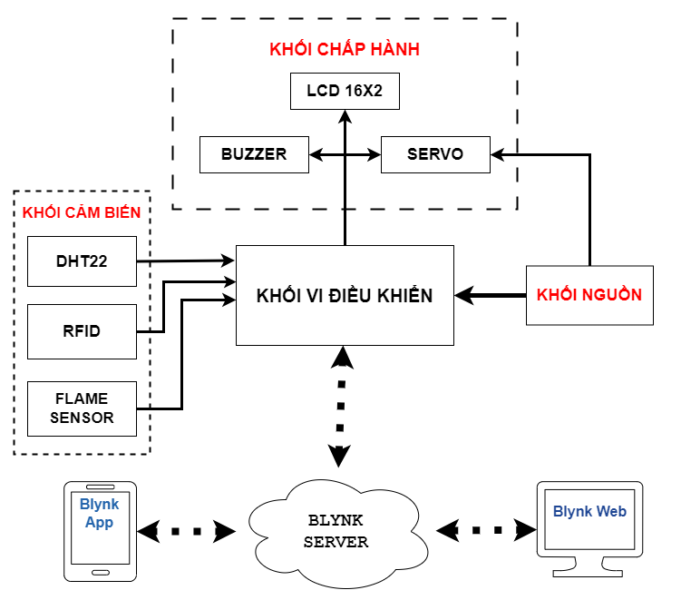
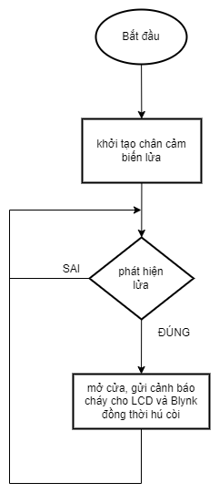

# Nhà thông minh freeRTOS

## Cài đặt

1. Clone mã nguồn từ github về máy tính:

	```bash
	git clone https://github.com/HM-Huong/smart-home-freeRTOS.git final-project
	cd final-project
	```

2. Mở file `final-project.ino` bằng Arduino IDE và chạy chương trình.

**Chú ý**: Tên của thư mục gốc của dự án phải là `final-project` để có thể chạy được bằng arduino IDE.

## Sơ đồ khối



## Sơ đồ nối chân

Các chân được sử dụng trong dự án được định nghĩa ở trong file [global.h](./global.h).


## Lưu đồ thuật toán

### [loopTask](./final-project.ino)


### [printTask](./printTask.cpp)


### [cloudTask](./cloudTask.cpp)


### [rfidTask](./rfidTask.cpp)


### [dhtTask](./dhtTask.cpp)


### [doorTask](./doorTask.cpp)


### [flameSensorTask](./flameSensorTask.cpp)


